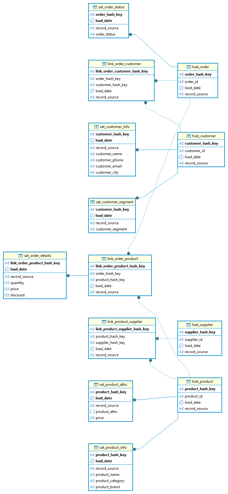

# База данных для платформы анализа продаж (магазин кроватей и матрасов)

Реализован на PostgreSQL  по методологии Data Vault 2.0.

---

## Содержание

- [Схема данных](#схема-данных)
- [Структура репозитория](#структура-репозитория)
- [Слои архитектуры](#слои-архитектуры)
- [Реализованные функции](#реализованные-функции)
- [Аналитические запросы](#аналитические-запросы)
- [Оптимизация](#оптимизация)
- [Как развернуть](#как-развернуть)

---

## Схема данных

Хранилище построено по методологии Data Vault: хабы (Hub), линки (Link), сателлиты (Satellite).

## ER-диаграмма

### Слои

| Схема | Назначение |
|-------|------------|
| `stg` | Staging: сырые данные из операционной системы |
| `dv` | Data Vault: хабы, линки, сателлиты |
| `analytics` | Витрины и представления для отчётов |

### Таблицы Data Vault (12)

**Хабы (4):**
- `dv.hub_customer` — клиенты
- `dv.hub_product` — товары
- `dv.hub_order` — заказы
- `dv.hub_supplier` — поставщики

**Линки (3):**
- `dv.link_order_customer` — связь заказ - клиент
- `dv.link_order_product` — связь заказ - товар
- `dv.link_product_supplier` — связь товар - поставщик

**Сателлиты (6):**
- `dv.sat_customer_info` — данные клиента (имя, телефон, город)
- `dv.sat_customer_segment` — история сегментов клиента
- `dv.sat_product_info` — название, категория, бренд
- `dv.sat_product_attrs` — характеристики товара в JSONB + цена
- `dv.sat_order_status` — статусы заказа
- `dv.sat_order_details` — количество, цена, скидка по позиции

---

## Структура репозитория
├── 00_init/ — создание схем
├── 01_functions/ — функция хеширования
├── 02_tables/ — таблицы staging и Data Vault
│ ├── stg/
│ └── dv/
│ ├── hubs/
│ ├── links/
│ └── satellites/
├── 03_indexes/ — индексы
├── 04_seed_data/ — тестовые данные и загрузка в DV
├── 05_analytics/ — представления и аналитические запросы
├── 06_optimization/ — EXPLAIN ANALYZE
└── README.md

---

## Реализованные функции

### `dv.generate_hash_key(VARIADIC TEXT[])`

Генерирует SHA-256 хеш от одного или нескольких бизнес-ключей.
Используется для создания первичных ключей во всех таблицах Data Vault.

-- Хаб: один бизнес-ключ
SELECT dv.generate_hash_key('C001');

-- Линк: два бизнес-ключа
SELECT dv.generate_hash_key('ORD001', 'P001');

Аналитические запросы
Динамика продаж по месяцам — с накопительным итогом и процентом роста.

Сегментация клиентов — ранжирование по сумме покупок, доля в выручке.

Топ товаров по категориям — RANK() OVER (PARTITION BY ...).

Средний чек по городам — с долей VIP-заказов.

Повторные покупки — интервал между первым и вторым заказом клиента.

Представления
analytics.v_customer_current — актуальные данные клиента (последняя версия из сателлита).

analytics.v_product_current — актуальные данные товара.

analytics.v_sales_details — витрина продаж для отчётов.

Сегментация данных
В файле 05_analytics/04_customer_segmentation.sql реализована логика сегментации:

Клиенты (RFM-анализ)
Метрики:

R (Recency) — сколько дней прошло с последней покупки.

F (Frequency) — сколько заказов сделал клиент.

M (Monetary) — сколько всего потратил.

Правила сегментации:

Сегмент	Условие
VIP	Потратил ≥ 150 000 ₽, сделал ≥ 2 заказов, покупал в течение года
Лояльный	Потратил ≥ 80 000 ₽ ИЛИ сделал ≥ 3 заказов
Активный	Последняя покупка ≤ 180 дней назад
Спящий	Все остальные
Товары
Сегмент	Условие
Хит	Выручка ≥ 150 000 ₽
Средний	Выручка ≥ 80 000 ₽
Низкий	Выручка < 80 000 ₽

Оптимизация
Созданные индексы
На бизнес-ключи хабов (customer_id, product_id и т.д.) — ускоряют поиск при загрузке данных.

На пары (hash_key, load_date DESC) в сателлитах — ускоряют выбор последней версии записи.

Сравнение производительности
В файле 06_optimization/01_explain_analysis.sql проведено сравнение Seq Scan и Index Scan.

=======
# База данных для платформы анализа продаж (магазин кроватей и матрасов)

Реализован на PostgreSQL  по методологии Data Vault 2.0.

---

## Содержание

- [Схема данных](#схема-данных)
- [Структура репозитория](#структура-репозитория)
- [Слои архитектуры](#слои-архитектуры)
- [Реализованные функции](#реализованные-функции)
- [Аналитические запросы](#аналитические-запросы)
- [Оптимизация](#оптимизация)
- [Как развернуть](#как-развернуть)

---

## Схема данных

Хранилище построено по методологии Data Vault: хабы (Hub), линки (Link), сателлиты (Satellite).

## ER-диаграмма

### Слои

| Схема | Назначение |
|-------|------------|
| `stg` | Staging: сырые данные из операционной системы |
| `dv` | Data Vault: хабы, линки, сателлиты |
| `analytics` | Витрины и представления для отчётов |

### Таблицы Data Vault (12)

**Хабы (4):**
- `dv.hub_customer` — клиенты
- `dv.hub_product` — товары
- `dv.hub_order` — заказы
- `dv.hub_supplier` — поставщики

**Линки (3):**
- `dv.link_order_customer` — связь заказ - клиент
- `dv.link_order_product` — связь заказ - товар
- `dv.link_product_supplier` — связь товар - поставщик

**Сателлиты (6):**
- `dv.sat_customer_info` — данные клиента (имя, телефон, город)
- `dv.sat_customer_segment` — история сегментов клиента
- `dv.sat_product_info` — название, категория, бренд
- `dv.sat_product_attrs` — характеристики товара в JSONB + цена
- `dv.sat_order_status` — статусы заказа
- `dv.sat_order_details` — количество, цена, скидка по позиции

---

## Структура репозитория
├── 00_init/ — создание схем
├── 01_functions/ — функция хеширования
├── 02_tables/ — таблицы staging и Data Vault
│ ├── stg/
│ └── dv/
│ ├── hubs/
│ ├── links/
│ └── satellites/
├── 03_indexes/ — индексы
├── 04_seed_data/ — тестовые данные и загрузка в DV
├── 05_analytics/ — представления и аналитические запросы
├── 06_optimization/ — EXPLAIN ANALYZE
└── README.md

---

## Реализованные функции

### `dv.generate_hash_key(VARIADIC TEXT[])`

Генерирует SHA-256 хеш от одного или нескольких бизнес-ключей.
Используется для создания первичных ключей во всех таблицах Data Vault.

-- Хаб: один бизнес-ключ
SELECT dv.generate_hash_key('C001');

-- Линк: два бизнес-ключа
SELECT dv.generate_hash_key('ORD001', 'P001');

Аналитические запросы
Динамика продаж по месяцам — с накопительным итогом и процентом роста.

Сегментация клиентов — ранжирование по сумме покупок, доля в выручке.

Топ товаров по категориям — RANK() OVER (PARTITION BY ...).

Средний чек по городам — с долей VIP-заказов.

Повторные покупки — интервал между первым и вторым заказом клиента.

Представления
analytics.v_customer_current — актуальные данные клиента (последняя версия из сателлита).

analytics.v_product_current — актуальные данные товара.

analytics.v_sales_details — витрина продаж для отчётов.

Сегментация данных
В файле 05_analytics/04_customer_segmentation.sql реализована логика сегментации:

Клиенты (RFM-анализ)
Метрики:

R (Recency) — сколько дней прошло с последней покупки.

F (Frequency) — сколько заказов сделал клиент.

M (Monetary) — сколько всего потратил.

Правила сегментации:

Сегмент	Условие
VIP	Потратил ≥ 150 000 ₽, сделал ≥ 2 заказов, покупал в течение года
Лояльный	Потратил ≥ 80 000 ₽ ИЛИ сделал ≥ 3 заказов
Активный	Последняя покупка ≤ 180 дней назад
Спящий	Все остальные
Товары
Сегмент	Условие
Хит	Выручка ≥ 150 000 ₽
Средний	Выручка ≥ 80 000 ₽
Низкий	Выручка < 80 000 ₽

Оптимизация
Созданные индексы
На бизнес-ключи хабов (customer_id, product_id и т.д.) — ускоряют поиск при загрузке данных.

На пары (hash_key, load_date DESC) в сателлитах — ускоряют выбор последней версии записи.

Сравнение производительности
В файле 06_optimization/01_explain_analysis.sql проведено сравнение Seq Scan и Index Scan.

Результат: план запроса меняется с полного перебора таблицы (Seq Scan) на точечный поиск по индексу (Index Scan).
